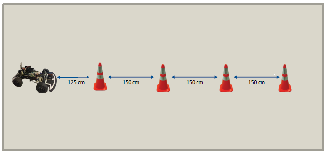
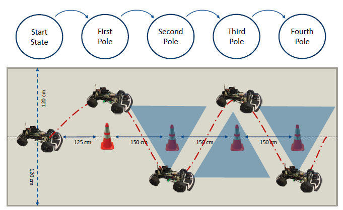
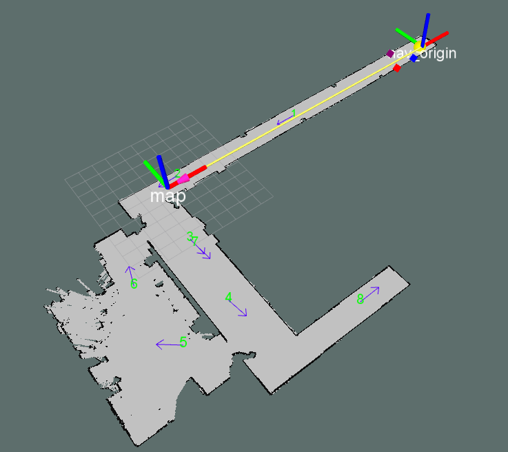
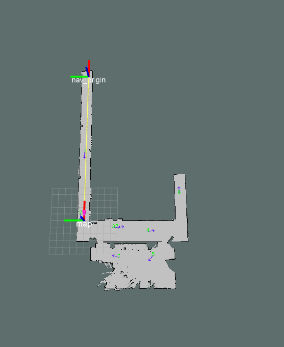
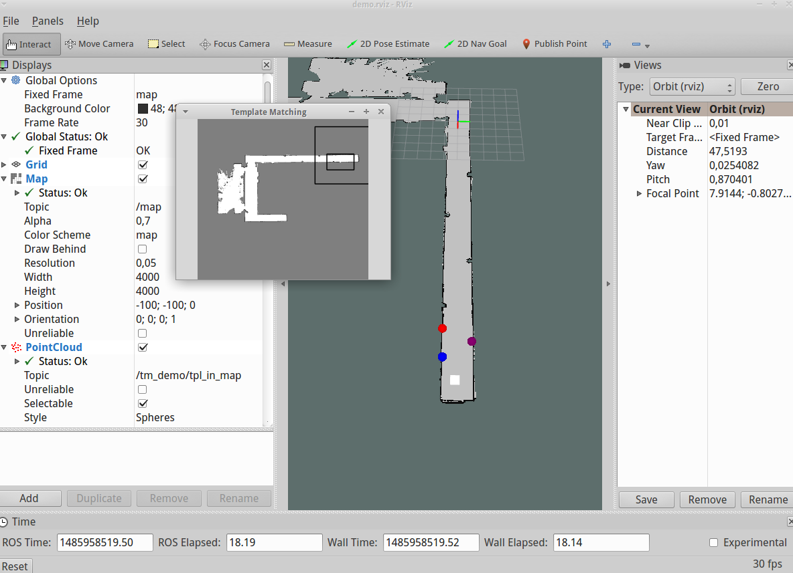
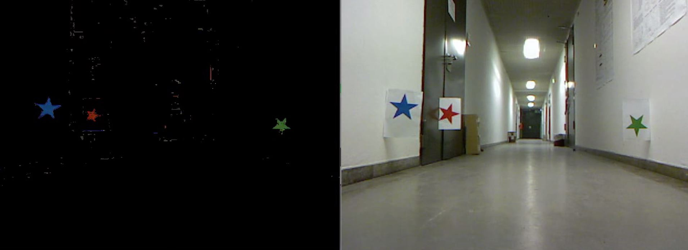
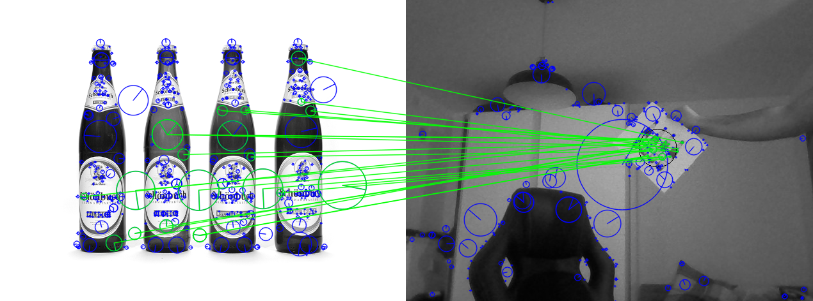

tas_car
=======

## Basic setup for the TAS stack

Please follow the intruction in tas/doc/Latex/LSR-TAS.pdf to setup and run the packages 

# Introduction
In the following, we will present nodes that were written by members of group 1. Alexandros Sivris and Benjamin Braun worked on visual navigation/ visual localization, Philipp Schreiber and Juri Fedjaev worked on the Slalom node. Besides their individual contribution to the project, all members worked on the mapping of the N8 basement. 

# 1. The Slalom Course
### A contribution by Philipp Schreiber and Juri Fedjaev 

#### Files ####
*	slalom/include/slalom.h
*	slalom/launch/slalom.launch
*	slalom/nodes/slalom_node.cpp
*	slalom/src/main.cpp
*	slalom/src/slalom.cpp

#### Description ####
This node is dedicated to the slalom task, as described in the document "/prototypes/slalom/TAS_task_description.pdf". The outline of the setup is shown in the figure below: 
 

In order to drive the slalom course, we set navigation goals next to each position of the traffic cones. As the odometry of the TAS car is very poor, we use data from the laser scanner to improve our pose estimate when arriving at the goals. For that purpose, we defined a simple state machine, as may be seen in the figure below:
 

#### How to run the node ####
To run the node we prepared a launch file called `slalom.launch` which is located in the "slalom/launch" folder.  There are no external packages needed. The node works out of the box with the basic ROS navigation stack installed. 

# 2. Alexandros Sivris  #
### My contribution for the TAS project ###
 
#### 2.1 Contents ####
1. Navigation tools package
	0. Requirements
	1. Visual localization
	2. Map goals
	3. Waypoint setter (unfinished)
	
2. Prototypes
	1. Visual localization demo
	2. Template detection prototype using contours 
	3. Template detection prototype using contours fusioned with ORB 
	
The complete documentation of the code can be seen [here](README_Alexandros_Sivris/doc/index.html) 

## 2.1.1 Navigation tools package ##
### Requirements ###
As mentioned in the section [Visual localization](visual_localization.md)  the package requires the external packages:
1. usb_cam
2. hector_compressed_map_transport (optional, not recommended)
Further dependencies will be listed below

#### Dependencies ####
*	ROS Indigo running under Linux (14.04 LTS)
*	OpenCV 3 (developed with OpenCV 3.2.0-dev)
*	cv_bridge package of vision opencv project (if not already installed, it can be fetched from https://github.com/ros-perception/vision_opencv.git)
*	C/C++ compiler (development with gcc version 4.8.4)
*	RapidXML library (already included in the package include folder, no need to download)
*	CMake has to be installed

### Node: Visual Localization ###
#### Files ####
*	navigation_tools/visual_localization/main.cpp
*	navigation_tools/visual_localization/src/visuallocalization.h
*	navigation_tools/visual_localization/src/visuallocalization.cpp
*	navigation_tools/visual_localization/src/landmarkdetector.h
*	navigation_tools/visual_localization/src/landmarkdetector.cpp
*	navigation_tools/visual_localization/src/landmarkmatcher.h
*	navigation_tools/visual_localization/src/landmarkmatcher.cpp
*	navigation_tools/visual_localization/src/my_types.h

#### Description ####
In this node I calculate the pose estimate of the car using a non-linear system of three equations. These equations result from the circles drawn around the three detected landmarks with radius equal to the distance between the car and the corresponding landmark. This distance is read out from the laser scanner

#### How to run the node ####
To run the node I prepared a launch file called `localization.launch` which is located in the "navigation_tools/launch" folder. The recommended way to run the node is by loading the map from an image file (which is set by default in line 5 of `localization.launch`). Alternatively, the map could also be fetched from the node `map_to_image_node` from the `ector_compressed_map_transport` package (this is not a good option though, because the map is very large and this would require that all the data is published on a ROS topic). 
The node will start by finding the position of the loaded landmarks in the map and then it will wait for image data coming from the usb camera, which can be mounted on top of the car. Therefore, the package `usb_cam`  **must** be launched in order to receive image data in the topic "/usb_cam/image_raw".

### Node: Map goals ###
#### Files ####
*	navigation_tools/map_goals/src/main.cpp
*	navigation_tools/map_goals/src/XMLPoses.cpp
*	navigation_tools/map_goals/src/send_nav_goals.cpp
*	navigation_tools/map_goals/src/XMLPoses.hpp
*	navigation_tools/map_goals/src/send_nav_goals.h
*	navigation_tools/map_goals/src/poses.xml

#### Description ####
In this node I publish the waypoints for autonomous navigation and send them to the action client. The waypoints are loaded from an XML file and their origin is the `nav_origin` frame. 

#### How to run the node ####
Before running the map goals node, the `nav_origin` frame has to be broadcasted. Therefore, run the `visual_localization` node (`localization.launch`) *before* running the `map_goals` node. (`autonomous_driving.launch`). If the visual localization was not successful, set the argument `visual_localization_successful` in the `autonomous_driving.launch` file to **false** (default), otherwise to **true**. 
 
Also, to send the waypoints to the move base change the parameter `send_goals` from **false** to **true**. It is **false** by default, becase otherwise the node gets stuck if there is no move base (and this is very annoying when you are not working directly on the car, but an a PC that has no move base server running).
The demo video can be found [here](videos/autonomous_driving_demo.ogv). In this demo I show how I change the different waypoints using the files generated by the waypoint setter tool.

### Node: Waypoint setter ###
#### Files ####
*	navigation_tools/waypoint_setter/main.cpp
*	navigation_tools/waypoint_setter/src/waypointsetter.cpp
*	navigation_tools/waypoint_setter/src/waypointsetter.h

#### Description ####
This node is a tool for setting the waypoint poses for the `map_goals` node, i.e. preparing the XML file. Unfortunately I could not finish this node, but the idea is that it subscribes to the `/initialpose` topic and reads all the poses that are choses in Rviz with the `2D Pose Estimate` tool. In the end all of the waypoints are saved in an XML file that can be exported to the `map_goals` node.

#### How to run the node ####
To run the waypoint setter tool, just launch the file `waypoint_setter.launch` from the `launch` folder in the `navigation_tools` package.
The target location of the `poses.xml` file is the `waypoint_setter` folder of the `navigation_tools` package.
I also included a demo video that can be found under [this link](videos/waypoints_setter_demo.ogv). 

## 2.1.2 Prototypes ##
### Node: Visual localization demo ###
#### Files ####
*	protoypes/template_matching/src/main.cpp
*	protoypes/template_matching/resources/map2.jpg
*	protoypes/template_matching/resources/tpl4.jpg
*	protoypes/template_matching/resources/tpl3.jpg
*	protoypes/template_matching/map_server/map2.yaml
*	protoypes/template_matching/map_server/map2.pgm
*	protoypes/template_matching/launch/visual_localization_demo.launch
*	protoypes/template_matching/CMakeLists.txt
*	protoypes/template_matching/demo.rviz

#### Description ####
The correctness of the visual localization algorithm is proven in this demo.

#### How to run the node ####
To run the demo, simply launch the file `visual_localization_demo.launch`. It will launch a map_server, set the input parameters and run rviz with a pre-defined configuration file. The input parameters are distance that would otherwise have been obtained from a real world laser scanner. To test the algorithm for another point (the default distances reslult in a point at approx. x=24 and y=0) simply click on a test point in the map by using the Rviz tool `Publish point` and note the values. Now, calculate the (Euclidean) distance between this test point and all the three template points (A: [20.5, -0.65], B: [21.35, 1], C: [22.4, -0.6]). These distances then have to be inserted into the corresponding parameters in the `visual_localization_demo.launch` file. The output should be approximately equal to the selected test point from before. Note that Rviz sometimes crashes. In case this happens retry to launch the launch file.
The waypoints are shown in the colored point cloud (displayed as spheres) and the car position is represented by the white box (also a point in a point cloud).
A demo video can be found [here](videos/visual_localization_demo.ogv). 
 

### Template detection prototype using contours ###

#### Files ####
*	prototypes/detection/detection_color_masks.cpp

#### Description ####
In this file I did all the tests related to contour matching in OpenCV before implementing them in a ROS node. The image below shows how the car would perceive the templates in the given environment.

### Template detection prototype using contours fusioned with ORB ###

#### Files ####
*	prototypes/detection/color_masks_and_orb.cpp

#### Description ####
In this file I did all the tests related to contour matching together with ORB in OpenCV before implementing them in a ROS node. 

# 3. Benjamin Braun
### My contribution

#### LandmarkDetector ####
 

#### Files ####
*	object_detection/launch/landmarkdetector.launch
*	object_detection/main.cpp
*	object_detection/src/landmarkdetector.cpp
*   object_detection/src/landmarkdetector.h
*	object_detection/msg/landmark.msg
*	object_detection/resources/

### Description ###
This node is dedicated to our second task "Visual Localization". 

In the node `landmarkdetector` of the package `object_detection` I recognize landmarks in our local environment using the given camera image of a simple RGB-Webcam. 
For this purpose is used the algorithms SIFT/SURF/ORB to detect and describe keypoints in the image, and a Brute-Force-Matcher to match the detected keypoints with known templates. To improve the robustness, i calculate the homography matrix of the template in my camera image using RANSAC, to only consider inliers. 

### Docu ###
Further documentation of the code can be seen [here](object_detection/doc/html/index.html) 

### How to run the node ###
To run the node I prepared a launch file within the folder "object_detection/launch", called `landmarkdetector.launch`. In this launch file the paths to the template-image-files can be specified. After specifying these, the node can be started using the following syntax:
`roslaunch object_detection landmarkdetector.launch`

### Dependencies ###
*	ROS Indigo running under Linux (tested and developed under 16.04.01 LTS)
*	OpenCV 3 (tested developed with OpenCV 3.2.0-dev)
*	NOTE: because SIFT/SURF is not included in the default package of OpenCV 3.x, OpenCV has to be built with the `opencv_contrib` modules. Therefore, the GIT repo https://github.com/opencv/opencv_contrib has to be cloned and cmake has to be configured with the flag `OPENCV_EXTRA_MODULES_PATH` to  the "opencv_contrib/modules" directory. (See for example http://docs.opencv.org/3.1.0/de/d25/tutorial_dnn_build.html)
