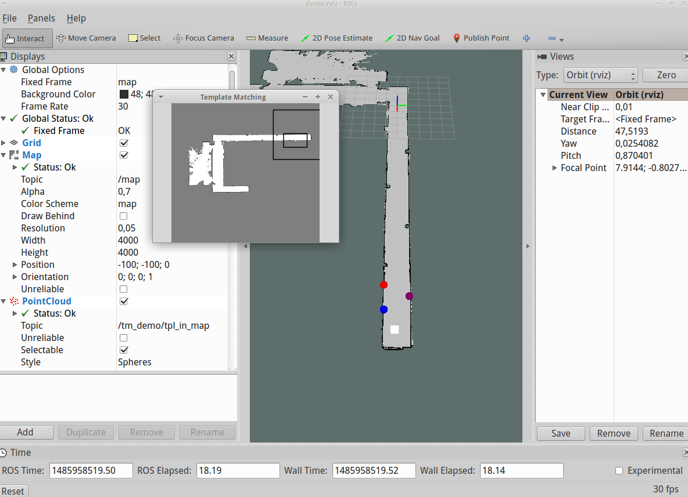

## 2. Prototypes ##
### Visual localization demo ###
#### Files ####
*	protoypes/template_matching/src/main.cpp
*	protoypes/template_matching/resources/map2.jpg
*	protoypes/template_matching/resources/tpl4.jpg
*	protoypes/template_matching/resources/tpl3.jpg
*	protoypes/template_matching/map_server/map2.yaml
*	protoypes/template_matching/map_server/map2.pgm
*	protoypes/template_matching/launch/visual_localization_demo.launch
*	protoypes/template_matching/CMakeLists.txt
*	protoypes/template_matching/demo.rviz

#### Description ####
The correctness of the visual localization algorithm is proven in this demo.

#### How to run the node ####
To run the demo, simply launch the file `visual_localization_demo.launch`. It will launch a map_server, set the input parameters and run rviz with a pre-defined configuration file. The input parameters are distance that would otherwise have been obtained from a real world laser scanner. To test the algorithm for another point (the default distances reslult in a point at approx. x=24 and y=0) simply click on a test point in the map by using the Rviz tool `Publish point` and note the values. Now, calculate the (Euclidean) distance between this test point and all the three template points (A: [20.5, -0.65], B: [21.35, 1], C: [22.4, -0.6]). These distances then have to be inserted into the corresponding parameters in the `visual_localization_demo.launch` file. The output should be approximately equal to the selected test point from before. Note that Rviz sometimes crashes. In case this happens retry to launch the launch file.
 
The waypoints are shown in the colored point cloud (displayed as spheres) and the car position is represented by the white box (also a point in a point cloud).